# Comandos_Linux
Comandos, descripcion y ejemplos

# LISTA DE COMANDOS LINUX 

- __CD__:
     El comando cd (change directory) permite moverse entre directorios del sistema.

    cd {ruta\_absoluta\_o\_relativa}
    Puedes cambiar de directorio especificando la ruta absoluta desde el directorio raíz o relativa desde tu ubicación actual, en Linux el directorio actual se indica con el signo .
    Los siguientes tres comandos realizan la misma acción para moverte al directorio mi\_carpeta

    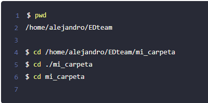

- __PWD:__ S
    ignifica Personal Working Directory te muestra la ruta del directorio en que estás ubicado actualmente. 
    
    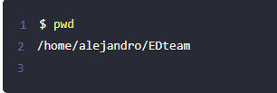

- __LS:__ 
    Este comando lista los archivos y directorios de la carpeta actual.
    
    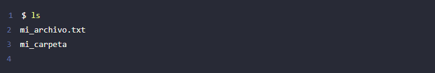

- __RMDIR:__ 
    El comando rmdir (Remove directory) elimina carpetas vacías. Su sintaxis es: rmdir {nombre\_carpeta}

    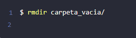

- __TOUCH:__ 
    Con este comando puedes crear nuevos archivos en el directorio actual.

    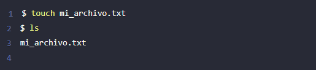

- __RM:__ El comando rm (Remove) elimina archivos. Su sintaxis es rm {nombre\_del\_archivo}

    Para eliminar directorios no vacíos usa el comando rm con la opción -r
    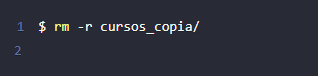

- __MV:__ 
    El comando mv (Move) mueve directorios o archivos de una ubicación a otra. Su sintaxis es: mv {ubicación\_actual} {nueva\_ubicación}
    
    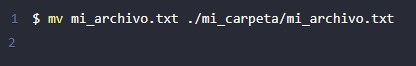

- __CP:__
    El comando cp (Copy) copia archivos o directorios. Su sintaxis es cp {origen} {destino}

    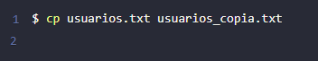

- __FIND:__ 
    Con el comando find y la opción -iname puedes encontrar archivos. La sintaxis es: find {donde\_buscar} -iname {archivo\_a\_buscar}

    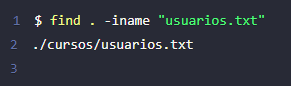

- __CAT:__ 
    El comando cat te permite leer el contenido de archivos.

    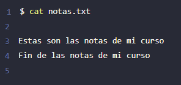

- __HEAD:__ 
    Se utiliza para mostrar información,  si lo usamos sin parámetros, de las 10 primeras líneas de un archivo en la salida estándar.  También se puede utilizar para mostrar información de varios ficheros a la vez.

    No tiene un gran número de parámetros, el más importante es «-n«, donde indicamos el número de líneas que queremos que nos muestre.
    
    Por ejemplo:
    
    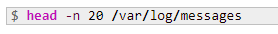       
    De esta manera, en vez de mostrar 10 líneas, nos mostrará 20. El mismo resultado lo podemos encontrar, de la siguiente manera, utilizando el guión «–»

- __LESS:__ 
    El comando less se usa para mostrar texto en la pantalla del terminal. Sólo muestra el texto del archivo dado, no puedes editar o manipular el texto. Para mostrar el archivo desde la línea especificada, introduce el número de línea seguido de dos puntos (:). Permite movimiento hacia adelante y hacia detrás en el archivo.

    SINTAXIS:La sintaxis es less [opciones] nombre_de_archivo 
    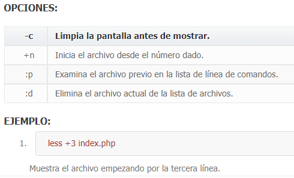

- __WC:__ 
    (word count) es un comando utilizado en el sistema operativo Unix que permite realizar diferentes conteos desde la entrada estándar, ya sea de palabras, caracteres o saltos de líneas.

    El programa lee la entrada estándar o una lista concatenada y genera una o más de las estadísticas siguientes: conteo de líneas, conteo de palabras, y conteo de bytes. Si se le pasa como parámetro una lista de archivos, muestra estadísticas de cada archivo individual y luego las estadísticas generales.
    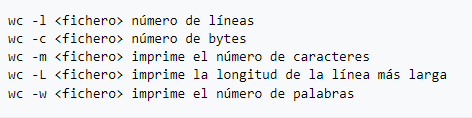
